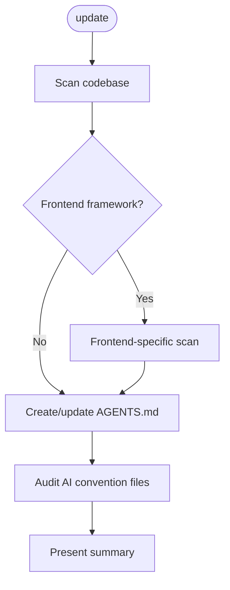

# AI-Ready

Keep a project AI-friendly by maintaining accurate `AGENTS.md` files and a clean set of AI convention files.

## What It Does

The `/ai-ready:update` command scans a codebase and:

1. **Creates or updates `AGENTS.md`** at the project root with project-specific instructions for AI coding agents — build commands, test procedures, code style, architecture, and conventions.
2. **Audits AI convention files** (`.cursorrules`, `CLAUDE.md`, `.github/copilot-instructions.md`, etc.) — keeps tool-specific ones that are auto-loaded by their tools, merges redundant ones into `AGENTS.md`, updates stale ones, or creates missing ones.
3. **Detects monorepos** and recommends nested `AGENTS.md` files for subprojects.

## Phase Flow



## Usage

```text
/ai-ready:update
```

## When to Run

- **First time:** When onboarding a project that doesn't have an `AGENTS.md` yet
- **After changes:** After significant codebase changes (new dependencies, restructured directories, changed build/test commands)
- **Periodic audit:** To verify AI convention files are still accurate and not redundant

## Directory Layout

```text
ai-ready/
  SKILL.md              # Entry point — workflow overview
  guidelines.md         # Principles, limits, safety, quality standards
  README.md             # This file
  commands/
    update.md           # /update command — loads guidelines + skill
  skills/
    update.md           # The scan and update skill
    frontend-scan.md    # Frontend-specific constraint and pattern detection
```

## Artifacts

No `.artifacts/` output — this workflow writes directly to the target project's `AGENTS.md`.

## How It Works

1. Checks for an existing `AGENTS.md` (reads it as the baseline if found) and scans for all AI convention files in the project
2. Analyzes the codebase: package manifests, CI configs, linting, tests, build scripts, directory structure
3. Runs domain-specific scans when applicable (e.g., frontend constraint and pattern detection for projects using React, Vue, Angular, Svelte, Next.js, or Nuxt)
4. Creates `AGENTS.md` from scratch or applies surgical updates to the existing one, incorporating domain-specific findings
5. Audits other AI convention files — keeps tool-specific ones (e.g., `CLAUDE.md`, `.cursor/rules/`), merges redundant ones into `AGENTS.md`, flags stale ones
6. Validates all file paths and commands referenced in `AGENTS.md`
7. Presents a summary of all changes

## AGENTS.md Spec

This workflow follows the [AGENTS.md](https://agents.md/) convention — a standard Markdown file that gives AI coding agents the context they need to work effectively in a codebase. It complements `README.md` by providing agent-specific instructions: build steps, test commands, code conventions, and architecture details.

`AGENTS.md` is supported by Cursor, Claude Code, GitHub Copilot, OpenAI Codex, Google Jules, Windsurf, JetBrains Junie and many others.
