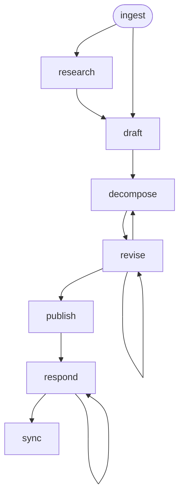

# Design Workflow

A design-and-decompose workflow that ingests a PRD, researches the external problem space, drafts a technical design document, decomposes into Jira-ready epics and stories, revises based on feedback, publishes as a GitHub PR, responds to reviewer comments, and syncs epics/stories to Jira.

## Phase Flow



## Prerequisites

| Tool | Required | Purpose |
|------|----------|---------|
| Jira access (MCP or CLI) | For `/ingest`, `/sync` | Fetch Feature issue, create epics/stories |
| GitHub CLI (`gh`) | For `/publish`, `/respond` | Create PRs, post review comments |
| Web search and URL fetching | For `/research` | Investigate external problem space |
| Git | Yes | Branch management, commits |

## Phases

| Phase | Command | Purpose | Artifact(s) |
|-------|---------|---------|-------------|
| Ingest | `/ingest` | Read PRD, explore codebase | `01-context.md` |
| Research | `/research` | Investigate problem space, solutions, standards | `02-research.md` |
| Design | `/draft` | Draft design document | `03-design.md` |
| Decompose | `/decompose` | Break into epics and stories | `04-epics.md`, `05-stories/`, `06-coverage.md` |
| Revise | `/revise` | Incorporate feedback | Updated design and/or stories |
| Publish | `/publish` | Post design doc as GitHub PR | `07-pr-description.md` |
| Respond | `/respond` | Address reviewer comments | `08-review-responses.md` |
| Sync | `/sync` | Sync Jira epics and stories | `sync-manifest.json` |

## Typical Flow

```text
/ingest EDM-2324
  → reads PRD from .artifacts/prd/EDM-2324/03-prd.md
  → explores affected codebase areas
  → writes .artifacts/design/EDM-2324/01-context.md

/research (conditional — when external integrations, standards, or unfamiliar domains are involved)
  → presents research plan to user for confirmation
  → iteratively searches, reads, and synthesizes external sources
  → writes 02-research.md

/draft
  → generates design document using templates/design.md structure
  → incorporates research findings if 02-research.md exists
  → follows templates/section-guidance.md for content standards
  → writes 03-design.md

/decompose
  → breaks design into epics and stories
  → validates coverage against PRD requirements
  → writes 04-epics.md, 05-stories/ (epics + stories), 06-coverage.md

/revise
  → user reviews, requests changes to design and/or decomposition
  → artifacts updated, consistency maintained
  → repeatable

/publish
  → commits design document to feature branch in docs repo
  → creates draft GitHub PR
  → writes 07-pr-description.md

/respond
  → fetches PR review comments
  → proposes responses (user approves before posting)
  → updates design document if needed
  → repeatable

/sync
  → previews all Jira operations (dry run)
  → syncs epics and stories — creates new, updates changed, closes removed
  → maintains sync-manifest.json with content hashes
```

## Artifacts

All artifacts are stored in `.artifacts/design/{issue-number}/`.

Epic and story files live under `05-stories/`. Each file maps 1:1 to a
Jira issue:

```text
.artifacts/design/EDM-2324/
  01-context.md
  02-research.md                       (if /research was run)
  03-design.md
  04-epics.md                          (metadata: ordering, dependencies)
  05-stories/
    epic-1-image-building.md           (→ Jira Epic)
    epic-1/
      story-01-scaffold-pipeline.md    (→ Jira Story)
      story-02-add-validation.md       (→ Jira Story)
    epic-2-deployment.md               (→ Jira Epic)
    epic-2/
      story-01-deploy-config.md        (→ Jira Story)
  06-coverage.md
  07-pr-description.md
  08-review-responses.md
  publish-metadata.json
  sync-manifest.json
```

## Design Document Template

The design document template (`templates/design.md`) follows the team's established structure:

1. Overview
2. Goals and Non-Goals
3. Motivation / Background
4. Design
   - 4.1 Architecture
   - 4.2 Data Model / Schema Changes
   - 4.3 API Changes
   - 4.4 Scalability and Performance
   - 4.5 Security Considerations
   - 4.6 Failure Handling and Recovery
   - 4.7 RBAC / Tenancy
   - 4.8 Extensibility / Future-Proofing
5. Alternatives Considered
6. Observability and Monitoring
7. Impact and Compatibility
8. Open Questions

Section-level guidance for the AI is in `templates/section-guidance.md`.

## Task Decomposition

The decomposition follows the team's Jira hierarchy:

- **Feature** (exists in Jira — input to this workflow)
  - **Epic** — user-value oriented, standalone, T-shirt sized
    - **Story** — right-sized, prefixed with `[DEV]`/`[UI]`/`[UX]`/`[QE]`/`[DOCS]`/`[CI]`

Key constraints:
- Each epic delivers complete functionality independently
- Each story leaves the system in a stable state (CI/CD to main)
- Every `[DEV]` story includes both functionality and testing (no deferred test stories)
- `[DOCS]` stories use a dedicated template with Documentation Scope and Documentation Inputs instead of Implementation Guidance and Testing Approach
- Tests validate the software's contract, not its implementation — use test types appropriate to the change (unit, integration, e2e)
- A coverage matrix ensures all PRD requirements are addressed

## Jira Sync

The `/sync` phase keeps Jira in sync with the approved decomposition:

- **Dry-run first** — always previews what would be created, updated, or closed
- **Batch operations** — epics first (confirm), then stories per epic (confirm)
- **Idempotent** — tracks synced items with content hashes in `sync-manifest.json`; re-running only acts on changes
- **Full CRUD** — creates new items, updates changed items (sync-owned fields only), closes items marked `status: removed`
- **Duplicate detection** — queries Jira before each creation to prevent duplicates, independent of the manifest

## Directory Structure

```text
design/
├── SKILL.md                    # Workflow entry point
├── guidelines.md               # Behavioral rules and guardrails
├── README.md                   # This file
├── templates/
│   ├── design.md               # Design document template
│   └── section-guidance.md     # AI instructions per section
├── skills/
│   ├── controller.md           # Phase dispatcher and transitions
│   ├── ingest.md               # Read PRD, explore codebase
│   ├── research.md             # Investigate problem space and solutions
│   ├── draft.md                # Draft design document
│   ├── decompose.md            # Break into epics and stories
│   ├── revise.md               # Incorporate feedback
│   ├── publish.md              # Create GitHub PR
│   ├── respond.md              # Address review comments
│   └── sync.md                 # Sync Jira issues
└── commands/
    ├── ingest.md               # /ingest command
    ├── research.md             # /research command
    ├── draft.md                # /draft command
    ├── decompose.md            # /decompose command
    ├── revise.md               # /revise command
    ├── publish.md              # /publish command
    ├── respond.md              # /respond command
    └── sync.md                 # /sync command
```

## Project-Level Template Override

Projects can customize the design document template by providing their own at a well-known location. The `/draft` phase checks for overrides in this order:

1. Path specified in the project's `CLAUDE.md` or `AGENTS.md`
2. `.design/templates/design.md` at the project root
3. Workflow's built-in template (fallback)

The same applies to `section-guidance.md`.

## Getting Started

```bash
# Install the workflow
./install.sh claude --workflows design

# Or install all workflows
./install.sh all
```

Then in your project, run the `design` workflow's `ingest` command for your Jira issue (e.g., EDM-2324).
