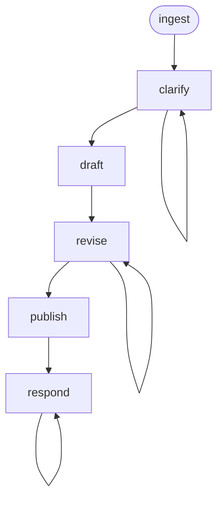

# PRD Workflow

A requirements-to-PRD workflow that ingests requirements from Jira, clarifies ambiguities through iterative Q&A, drafts a Product Requirements Document, revises based on feedback, publishes as a GitHub PR, and responds to reviewer comments.

## Phase Flow



## Prerequisites

| Tool | Required | Purpose |
|------|----------|---------|
| Jira access (MCP or CLI) | For `/ingest` | Fetch requirements from Jira issues |
| GitHub CLI (`gh`) | For `/publish`, `/respond` | Create PRs, post review comments |
| Git | Yes | Branch management, commits |

## Phases

| Phase | Command | Purpose | Artifact |
|-------|---------|---------|----------|
| Ingest | `/ingest` | Fetch requirements from Jira | `01-requirements.md` |
| Clarify | `/clarify` | Iterative Q&A to resolve gaps | `02-clarifications.md` |
| Draft | `/draft` | Generate PRD from template | `03-prd.md` |
| Revise | `/revise` | Incorporate user feedback | `03-prd.md` (updated) |
| Publish | `/publish` | Post as GitHub PR | `04-pr-description.md` |
| Respond | `/respond` | Address reviewer comments | `05-review-responses.md` |

## Typical Flow

```text
/ingest EDM-2324
  → fetches Jira issue, linked issues, comments
  → writes .artifacts/prd/EDM-2324/01-requirements.md

/clarify
  → asks targeted questions in batches of 3-5
  → tracks answers in 02-clarifications.md
  → stops when exit criteria are met

/draft
  → generates PRD using templates/prd.md structure
  → follows templates/section-guidance.md for content standards
  → writes 03-prd.md

/revise
  → user reviews, requests changes
  → PRD updated, consistency maintained
  → repeatable

/publish
  → commits PRD to feature branch
  → creates draft GitHub PR
  → writes 04-pr-description.md

/respond
  → fetches PR review comments
  → proposes responses (user approves before posting)
  → resolves open questions by incorporating answers into the relevant sections
  → updates PRD if needed
  → repeatable
```

## Artifacts

All artifacts are stored in `.artifacts/prd/{issue-number}/`.

## PRD Template

The PRD template (`templates/prd.md`) defines the document structure:

1. Problem Statement
2. Goals and Non-Goals (including Success Metrics)
3. Requirements (Functional and Non-Functional)
4. Acceptance Criteria
5. Assumptions
6. Dependencies
7. Risks
8. Open Questions

Section-level guidance for the AI is in `templates/section-guidance.md`.

## Directory Structure

```text
prd/
├── SKILL.md                    # Workflow entry point
├── guidelines.md               # Behavioral rules and guardrails
├── README.md                   # This file
├── templates/
│   ├── prd.md                  # PRD document template
│   └── section-guidance.md     # AI instructions per section
├── skills/
│   ├── controller.md           # Phase dispatcher and transitions
│   ├── ingest.md               # Fetch requirements from Jira
│   ├── clarify.md              # Iterative Q&A
│   ├── draft.md                # Generate PRD
│   ├── revise.md               # Incorporate feedback
│   ├── publish.md              # Create GitHub PR
│   └── respond.md              # Address review comments
└── commands/
    ├── ingest.md               # /ingest command
    ├── clarify.md              # /clarify command
    ├── draft.md                # /draft command
    ├── revise.md               # /revise command
    ├── publish.md              # /publish command
    └── respond.md              # /respond command
```

## Project-Level Template Override

Projects can customize the PRD template by providing their own at a well-known location. The `/draft` phase checks for overrides in this order:

1. Path specified in the project's `CLAUDE.md` or `AGENTS.md` (e.g., `PRD template: docs/templates/prd-template.md`)
2. `.prd/templates/prd.md` at the project root
3. Workflow's built-in template (fallback)

The same applies to `section-guidance.md`. Place both files alongside each other.

## Getting Started

```bash
# Install the workflow
./install.sh claude --workflows prd

# Or install all workflows
./install.sh all
```

Then in your project, run the `prd` workflow's `ingest` command for your Jira issue (e.g., EDM-2324).
